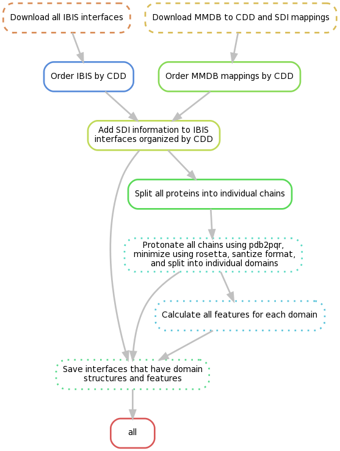

# molmimic

**Note: this is all research code and is not functional**

molmimic is a tool to annotate binding sites involved in protein-protein interactions (PPI) given the structure of only one of the interaction partners. This method differs from other binding site prediction programs becuase we treat the problem as a 3D image/volume segmentaion problem. We use Sparse 3D Fully Convolutionary Neural Networks, or Sparse 3D Unet, to make voxel level predictions, where each atom is mapped to one or more voxels.

In the future we hope to report binding partners, binding sites for protein-ligand interactions (PLI), sites shared by PPI an PLI for drug repurposing, and sites that are 'mimicking' known interactions, e.g. host-pathogen PPI.

# Requirements
Python requirements
```
pytorch>=0.4
torchvision
pytorchviz
tnt
SparseConvNet
numpy
scikit-learn
Biopython
seaborn
tqdm
dask
pandas
```
Non python requirements:
```
pdb2pqr
apbs
CNS
openbabel
DSSP
CX
```
All non-python requirments can be run using docker:
```
docker://edraizen/pdb2pqr:latest
docker://edraizen/apbs:latest
docker://edraizen/openbabel:latest
docker://edraizen/dssp:latest
docker://edraizen/cx:latest
```

Toil is a requirment, but cannot be installed autmatically through pip. You must choose which type of cluster you want to use:
```
pip install toil #Only local clusters
pip install toil[aws]
pip install toil[gce]
pip install toil[azure]
pip install toil[all]
```
# Download
```
git clone https://github.com/edraizen/molmimic.git
cd molmimic
git submodule init
git submodule update
```
If not running on aws or cloud-based cluster, install module with all requirements:
```python setup.py install
```
Else, follow the AWS steps in the Data generation section to install with all requirments

# Data Generation
To create all of the necessary data, please run the Toil workflow in the generate_data directory. You have the option to run this locally, on bare-metal cluster (e.g. SLURM or SGE), or on the cloud (e.g. AWS, Google Cloud, or Azure). For local or bare-metal cluster with shared filesytem, make sure all of the python dependencies are availble (and non python dependencies in your PATH if you don't want to use docker) and run the whole workflow or only part of it by calling:
```python /path/to/molmimic/generate_data/run.py file:dataset-name --defaultCores 4 --maxLocalJobs 1000```

For running on aws or other cloud options:
1) Follow [Preparing yur AWS environment](https://toil.readthedocs.io/en/3.15.0/running/cloud/amazon.html#preparing-your-aws-environment) instruction on toil documentation
1) Start the cluster
```
toil launch-cluster molmimic-cluster --keyPairName id_rsa --leaderNodeType t2.medium --zone us-east-1
```
2) Copy molmimic to the cluster
```
toil rsync-cluster -z us-east-1a molmimic-cluster -av molmimic :/root
```
3) SSH into the cluster
```
toil ssh-cluster molmimic-cluster --zone us-east-1
```
4) In the cluster's shell, create a virtual enviroment and install molmimic and its requirments (noting to make sure to use the --system-site-packages option!):
```
virtualenv --system-site-packages venv
. venv/bin/activate
cd /root/molmimic
pip install .
export PYTHONPATH=/venv/lib/python2.7/site-packages
```
5) Finally, run the workflow:
```
screen python -m molmimic.generate_data aws:us-east-1:dataset-name --provisioner aws --nodeTypes t2.micro --minNodes 100 --maxNodes 100 --maxLocalJobs 100 --targetTime 1 --preemptableCompensation 1.0 --batchSystem mesos
#or
screen python -m molmimic.generate_data.prepare_protein aws:us-east-1:dataset-name --provisioner aws --nodeTypes t2.micro --minNodes 100 --maxNodes 100 --maxLocalJobs 100 --targetTime 1 --preemptableCompensation 1.0 --batchSystem mesos

```



# Running (Examples using singularity)
## Training
```shell
run_singularity python molmimic/torch_train.py --use_deepsite_features --use-resnet-unet --epochs 100 --dropout-width --dropout-p 0.6 --learning-rate 0.00005 dataset_name /path/to/formated/interfaces.tsv
```

## Inference
```shell
run_singularity python molmimic/torch_test_simple.py --use_deepsite_features --use-resnet-unet --dropout-width --dropout-p 0.6 --learning-rate 0.00005 dataset_name path/to/model.pth
```

# Citations
1. SparseConvNet: Graham, Engelcke, Maaten. [arXiv:1711.10275](https://arxiv.org/abs/1711.10275)
2. 3D U-net: Cicek, Abdulkadir, *et al.* International Conference on Medical Image Computing and Computer Assisted Intervention. 2016. [arXiv](https://arxiv.org/abs/1606.06650)
3. IBIS LUCA: Goncearenco, Shaytan, *et al.* Biophysical J. 2015. [Pubmed](https://www.ncbi.nlm.nih.gov/pubmed/26213149)
4. IBIS: Shoemaker, Zhang, *et al.* Nucleic Acids Res. 2012. [Pubmed](https://www.ncbi.nlm.nih.gov/pubmed/22102591)
5. DeepSite: Jimenez, Doerr, *et al.* Bioinformatics. 2017. doi:10.1093/bioinformatics/btx350 [Pubmed](https://www.ncbi.nlm.nih.gov/pubmed/28575181)
6. 3DCNN: Torng, Altman. BMC Bioinformatics. 2017. doi:10.1186/s12859-017-1702-0. [Pubmed](https://www.ncbi.nlm.nih.gov/pubmed/28615003)
7. EnzyNet: Amidi, *et al.* [arXiv:1707.06017](https://arxiv.org/abs/1707.06017)
