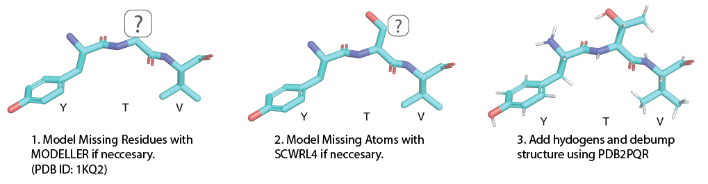
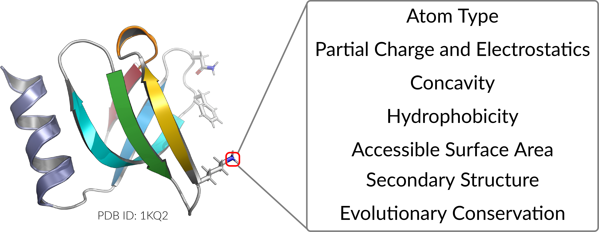

# Prop3D


Prop3D is a protein structure toolkit designed for machine learning, enabling the generation and utilization of datasets that integrate 3D atomic coordinates with biophysical and evolutionary properties. Due to the massive increase in the number of available protein structures, massively-parallel reproducible workflows to create datasets that run in the cloud are needed. Prop3D is not just a dataset or workflow, it is both; it's a way to reproduce our datatsets or build your own with your own custom proteins.

To use Prop3D, you can:

1. Use our precomputed datasets to train an ML model; 
1. Build your own datasets; and 
1. Use your new datasets to train an ML model.

We provide two precalculated datasets: 

1. Prop3D-20 (20 highly populated superfamilies) and 
1. The entire PDB. In the future.

We will provide the entire CATH database and AlphaFold-CATH -- CATH mappings for all domains in AlphaFold2.

If you want to generate your own datasets, please follow the installation steps for using the :doc:`./install/hsds.rst`


## Overview

First, we create Toil Jobs following the CATH Hierarchy


Next, we 'clean' each CATH domain structure by:



and then calculate biophysical and evolutionary properties for each atom in the given domain:



If you just want to use the dataset (and not recreate it), you can follow the instructions at http://github.com/bouralab/DeepUrfold to access the UVA HSDS endpoint.

## Installation


### 0. <i>If you are running locally, you can skip this step.</i> Toil is a requirement, but cannot be installed automatically through pip if running on a cluster.

You must choose which type of cluster you want to use during install, e.g. `pip install toil[aws]`

Please follow their instructions if not running locally: (https://toil.readthedocs.io/en/latest/)(https://toil.readthedocs.io/en/latest/)

### 1. Install Singularity (preferred) or Docker
https://docs.sylabs.io/guides/3.5/user-guide/quick_start.html#quick-installation-steps

### 2. Download & Install Prop3D
```
git clone https://github.com/bouralab/Prop3D.git
cd Prop3D
git submodule init
git submodule update
python setup.py install
```

All of the external tools have been dockerized (available at https://hub.docker.com/u/edraizen) and pulled when requested automatically in the code, so no further installation is necessary

### 3. Set up your own [HSDS](https://github.com/HDFGroup/hsds) endpoint

You can set up HSDS on any cloud platform or a single machine using Docker or on a cluster using Kubernetes (or AKS on Microsoft Azure).

For single machine setup, please follow instructions in the docs.


## Data Generation

### a. Use the Prop3D precalculated data

```bash
wget https://zenodo.org/record/6873024/files/Prop3D-20.h5
python -m Prop3D.generate_data.hsds file:load-Prop3D --maxLocalJobs 96 --load Prop3D-20.h5 $PROP3D_DATA #Change last path to whatever you want to name the file in HSDS

#alternitvaly, you can run the slow non-parallelized version:
#hsload Prop3D.h5 /home/$USER/Prop3D.h5 #Change last path to whatever you want to name the file in HSDS
```

### b. Recreate dataset

To create all of the necessary data, please run the Toil workflow in the generate_data directory. You have the option to run this locally, on bare-metal cluster (e.g. SLURM or SGE), or on the cloud (e.g. AWS, Google Cloud, or Azure). For local or bare-metal cluster with shared filesystem, make sure all of the python dependencies are available (and non python dependencies in your PATH if you don't want to use docker) and run the whole workflow or only part of it by calling:

```bash
export SFAM="1.10.10.10 1.10.238.10 1.10.490.10 1.10.510.10 1.20.1260.10 2.30.30.100 2.40.50.140 2.60.40.10 3.10.20.30 3.30.230.10 3.30.300.20 3.30.310.60 3.30.1360.40 3.30.1370.10 3.30.1380.10 3.40.50.300 3.40.50.720 3.80.10.10 3.90.79.10 3.90.420.10" #Change to include whichever superfamiles you want. If empty, it will run all CATH superfamilies
USE_SINGULARITY=True python -m Prop3D.generate_data.main file:prop3D-run --cathcode $SFAM --hsds_file /home/$USER/Prop3D.h5 --defaultCores 20 --maxLocalJobs 20
```
Make sure to replace `/home/$USER/Prop3D.h5` with the actual path of Prop3D inside HSDS.

To run individual PDB files and not use CATH, add parameter `--pdb` with PDB ids, paths to each PDB file, or to a text file with a list of PDB IDs or pdb files. Alternatively, you just add `--pdb` with no parmeters to include the PDB database.

For running on AWS or other cloud providers, follow [Preparing your AWS environment](https://toil.readthedocs.io/en/3.15.0/running/cloud/amazon.html#preparing-your-aws-environment) instruction in the Toil documentation.

## Citation

We will post the bioRxiv for Prop3D link soon
