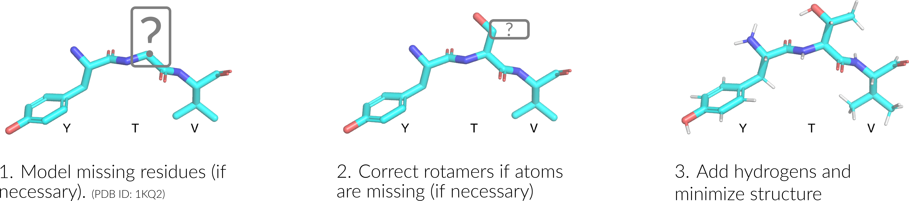

Meadowlark: Structure Processing Workflow
=========================================

We 'clean' or 'sanitize' a starting protein structure by applying the following approach. We begin with coordinate-preserving tasks:

#. Select first model (from among multiple possible models in a PDB file)
#. Select the correct chain
#. Select the first alternate location (if multiple conformers are present for an atom/residue). 
#. Remove hetero-atoms (water or buffer molecules, other crystallization reagents, etc.)

which are all achieved via pdb-tools (`Q114840802 <https://www.wikidata.org/wiki/Q114840802>`_). 

Finally, we then performing coordinate-modifying tasks for each domain structure via the following stages: 

#. Build/model any missing residues with MODELLER (`Q3859815 <https://www.wikidata.org/wiki/Q3859815>`_)
#. Correct/optimize rotamers with SCWRL4 (`Q114840881 <https://www.wikidata.org/wiki/Q114840881>`_), e.g. if there are any missing atoms
#. Add hydrogens and perform a rough potential energy minimization with the Pdb2Pqr (`Q62856803 <https://www.wikidata.org/wiki/Q62856803>`_).