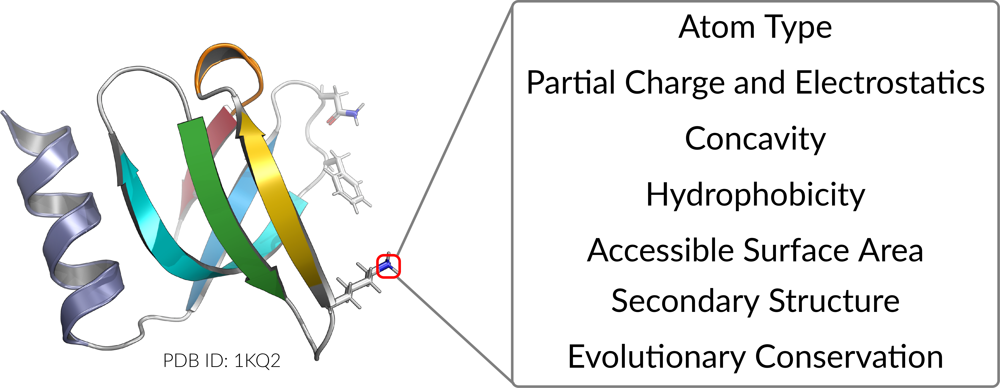

Features
========

Prop3D calculates the features for every atom in every protein/domain in a dataset, saving all results into different HDF datasets for each protein.

For atom-level features, we create one-hot encodings for 23 AutoDock atom names, 16 element names, and 21 residue types (20 standard amino acids and one UNKnown placeholder). We also include van der Waals radii, charges from Pdb2Pqr (`Q62856803 <https://www.wikidata.org/wiki/Q62856803>`_), electrostatic potentials computed via APBS (`Q65072984 <https://www.wikidata.org/wiki/Q65072984>`_), concavity values that we calculate via CX (`Q114841750 <https://www.wikidata.org/wiki/Q114841750>`_), various hydrophobicity features of the residue that an atom belongs to (Kyte-Doolite, Biological and Octanol), and two measures of accessible surface area (per-atom, via FreeSASA (`Q114841793 <https://www.wikidata.org/wiki/Q114841793>`_), and per-residue via DSSP (`Q5206192 <https://www.wikidata.org/wiki/Q5206192>`_)). We also include different types of secondary structure information: one-hot encodings for DSSP (`Q5206192 <https://www.wikidata.org/wiki/Q5206192>`_)) 3- and 7- secondary structure classifications, as well as the backbone torsion angles ($\phi$, $\psi$; along with embedded sine and cosine transformations of each). We also annotate aromaticity, and hydrogen bond acceptors and donors, based on AutoDock atom-name types. As a gauge of phylogenetic conservation, we include sequence entropy scores from EPPIC (`Q114841783 <https://www.wikidata.org/wiki/Q114841783>`_). These biophysical, physicochemical, structural, and phylogenetic features are summarized above and are exhaustively enumerated in the tables below. 

We also provide functionality to create discretized values of features via the application of Boolean logic operators to the corresponding continuous-valued quantities of a given descriptor, using simple numerical thresholding (Table \ref{table:bool-feats}).

All Features
------------

..  list-table:: Source Features (1-hot and continuous values)
    :header-rows: 1

    * -  | Feature
         |
         |
      -  | Voxel 
         | Aggregation 
         | Rule
      -  | Residue 
         | Aggregation 
         | Rule
      -  | Source Software 
         | or Database
         |

    * -  H
      -  max
      - 
      -  MGLTools (`Q114840701 <https://www.wikidata.org/wiki/Q114840701>`_)
    
    * - HD
      - max
      - 
      - MGLTools (`Q114840701 <https://www.wikidata.org/wiki/Q114840701>`_)
    
    * - HS
      - max
      - 
      - MGLTools (`Q114840701 <https://www.wikidata.org/wiki/Q114840701>`_)
    
    * - C
      - max
      - 
      - MGLTools (`Q114840701 <https://www.wikidata.org/wiki/Q114840701>`_)
    
    * - A
      - max
      - 
      - MGLTools (`Q114840701 <https://www.wikidata.org/wiki/Q114840701>`_)
    
    * - N
      - max
      - 
      - MGLTools (`Q114840701 <https://www.wikidata.org/wiki/Q114840701>`_)
    
    * - NA
      - max
      - 
      - MGLTools (`Q114840701 <https://www.wikidata.org/wiki/Q114840701>`_)
    
    * - NS
      - max
      - 
      - MGLTools (`Q114840701 <https://www.wikidata.org/wiki/Q114840701>`_)
    
    * - OA
      - max
      - 
      - MGLTools (`Q114840701 <https://www.wikidata.org/wiki/Q114840701>`_)
    
    * - OS
      - max
      - 
      - MGLTools (`Q114840701 <https://www.wikidata.org/wiki/Q114840701>`_)
    
    * - F
      - max
      - 
      - MGLTools (`Q114840701 <https://www.wikidata.org/wiki/Q114840701>`_)
    
    * - MG
      - max
      - 
      - MGLTools (`Q114840701 <https://www.wikidata.org/wiki/Q114840701>`_)
    
    * - P
      - max
      - 
      - MGLTools (`Q114840701 <https://www.wikidata.org/wiki/Q114840701>`_)
    
    * - SA
      - max
      - 
      - MGLTools (`Q114840701 <https://www.wikidata.org/wiki/Q114840701>`_)
    
    * - S
      - max
      - 
      - MGLTools (`Q114840701 <https://www.wikidata.org/wiki/Q114840701>`_)
    
    * - CL
      - max
      - 
      - MGLTools (`Q114840701 <https://www.wikidata.org/wiki/Q114840701>`_)
    
    * - CA
      - max
      - 
      - MGLTools (`Q114840701 <https://www.wikidata.org/wiki/Q114840701>`_)
    
    * - MN
      - max
      - 
      - MGLTools (`Q114840701 <https://www.wikidata.org/wiki/Q114840701>`_)
    
    * - FE
      - max
      - 
      - MGLTools (`Q114840701 <https://www.wikidata.org/wiki/Q114840701>`_)
    
    * - ZN
      - max
      - 
      - MGLTools (`Q114840701 <https://www.wikidata.org/wiki/Q114840701>`_)
    
    * - BR
      - max
      - 
      - MGLTools (`Q114840701 <https://www.wikidata.org/wiki/Q114840701>`_)
    
    * - I
      - max
      - 
      - MGLTools (`Q114840701 <https://www.wikidata.org/wiki/Q114840701>`_)
    
    * - Unk_atom
      - max
      - 
      - MGLTools (`Q114840701 <https://www.wikidata.org/wiki/Q114840701>`_)

    * - C_elem
      - max
      - 
      - PDB File
    
    * - N_elem
      - max
      - 
      - PDB File
    
    * - O_elem
      - max
      - 
      - PDB File
    
    * - S_elem
      - max
      - 
      - PDB File
    
    * - H_elem
      - max
      - 
      - PDB File
   
    * - F_elem
      - max
      - 
      - PDB File
    
    * - MG_elem
      - max
      - 
      - PDB File
    
    * - P_elem
      - max
      - 
      - PDB File
    
    * - CL_elem
      - max
      - 
      - PDB File
    
    * - CA_elem
      - max
      - 
      - PDB File
    
    * - MN_elem
      - max
      - 
      - PDB File
    
    * - FE_elem
      - max
      - 
      - PDB File
    
    * - ZN_elem
      - max
      - 
      - PDB File
   
    * -  BR_elem
      - max
      - 
      - PDB File
   
    * -  I_elem
      - max
      - 
      - PDB File
    
    * - Unk_elem
      - max
      - 
      - PDB File
    
    * - vdw
      - mean
      - yes
      - \cite{Bondi1964}
    
    * - partial charge (charge)
      - mean
      - sum
      - Pdb2Pqr (`Q62856803 <https://www.wikidata.org/wiki/Q62856803>`_)
   
    * -  electrostatic_potential
      - mean
      - sum
      - APBS (`Q65072984 <https://www.wikidata.org/wiki/Q65072984>`_)
    
    * - concavity (cx)
      - mean
      - mean
      - CX (`Q114841750 <https://www.wikidata.org/wiki/Q114841750>`_)
    
    * - hydrophobicity
      - mean
      - yes
      - Kyte-Doolittle
    
    * - biological_hydrophobicity
      - mean
      - yes
      - \cite{Hessa2005}
    
    * - octanal_hydrophobicity
      - mean
      - yes
      - Wimley-White 1996
    
    * - atom_asa
      - mean
      - 
      - FreeSASA (`Q114841793 <https://www.wikidata.org/wiki/Q114841793>`_)
    
    * - residue_rasa
      - mean
      - yes
      - DSSP (`Q5206192 <https://www.wikidata.org/wiki/Q5206192>`_)
    
    * - ALA
      - max
      - yes
      - PDB File
    
    * - CYS
      - max
      - yes
      - PDB File
    
    * - ASP
      - max
      - yes
      - PDB File
    
    * - GLU
      - max
      - yes
      - PDB File
    
    * - PHE
      - max
      - yes
      - PDB File
   
    * -  GLY
      - max
      - yes
      - PDB File
    
    * - HIS
      - max
      - yes
      - PDB File
    
    * - ILE
      - max
      - yes
      - PDB File
    
    * - LYS
      - max
      - yes
      - PDB File
    
    * - LEU
      - max
      - yes
      - PDB File
    
    * - MET
      - max
      - yes
      - PDB File
    
    * - ASN
      - max
      - yes
      - PDB File
    
    * - PRO
      - max
      - yes
      - PDB File
    
    * - GLN
      - max
      - yes
      - PDB File
    
    * - ARG
      - max
      - yes
      - PDB File
    
    * - SER
      - max
      - yes
      - PDB File
    
    * - THR
      - max
      - yes
      - PDB File
    
    * - VAL
      - max
      - yes
      - PDB File
    
    * - TRP
      - max
      - yes
      - PDB File
    
    * - TYR
      - max
      - yes
      - PDB File
    
    * - Unk_residue
      - max
      - yes
      - PDB File
    
    * - phi
      - mean
      - yes
      - BioPython (`Q4118434 <https://www.wikidata.org/wiki/Q4118434>`_)
   
    * - phi_sin
      - mean
      - yes
      - NumPy
    
    * - phi_cos
      - mean
      - yes
      - NumPy
    
    * - psi
      - mean
      - yes
      - BioPython (`Q4118434 <https://www.wikidata.org/wiki/Q4118434>`_)
    
    * - psi_sin
      - mean
      - yes
      - NumPy
    
    * - psi_cos
      - mean
      - yes
      - NumPy
    
    * - is_helix
      - max
      - yes
      - DSSP (`Q5206192 <https://www.wikidata.org/wiki/Q5206192>`_)
    
    * - is_sheet
      - max
      - yes
      - DSSP (`Q5206192 <https://www.wikidata.org/wiki/Q5206192>`_)
    
    * - Unk_SS
      - max
      - yes
      - DSSP (`Q5206192 <https://www.wikidata.org/wiki/Q5206192>`_)
    
    * - is_regular_helix
      - max
      - yes
      - DSSP (`Q5206192 <https://www.wikidata.org/wiki/Q5206192>`_)
    
    * - is_beta_bridge
      - max
      - yes
      - DSSP (`Q5206192 <https://www.wikidata.org/wiki/Q5206192>`_)
    
    * - is_extended_strand
      - max
      - yes
      - DSSP (`Q5206192 <https://www.wikidata.org/wiki/Q5206192>`_)
    
    * - is_310_helix
      - max
      - yes
      - DSSP (`Q5206192 <https://www.wikidata.org/wiki/Q5206192>`_)
   
    * - is_pi_helix
      - max
      - yes
      - DSSP (`Q5206192 <https://www.wikidata.org/wiki/Q5206192>`_)
    
    * - is_hbond_turn
      - max
      - yes
      - DSSP (`Q5206192 <https://www.wikidata.org/wiki/Q5206192>`_)
    
    * - is_bend
      - max
      - yes
      - DSSP (`Q5206192 <https://www.wikidata.org/wiki/Q5206192>`_)
    
    * - no_ss
      - max
      - yes
      - DSSP (`Q5206192 <https://www.wikidata.org/wiki/Q5206192>`_)
    
    * - hydrophobic_atom
      - max
      - 
      - MGLTools (`Q114840701 <https://www.wikidata.org/wiki/Q114840701>`_)
    
    * - aromatic_atom
      - max
      - 
      - MGLTools (`Q114840701 <https://www.wikidata.org/wiki/Q114840701>`_)
    
    * - hbond_acceptor
      - max
      - 
      - MGLTools (`Q114840701 <https://www.wikidata.org/wiki/Q114840701>`_)
    
    * - hbond_donor
      - max
      - 
      - MGLTools (`Q114840701 <https://www.wikidata.org/wiki/Q114840701>`_)
    
    * - metal
      - max
      - 
      - MGLTools (`Q114840701 <https://www.wikidata.org/wiki/Q114840701>`_)
    
    * - eppic_entropy
      - min
      - yes
      - EPPIC (`Q114841783 <https://www.wikidata.org/wiki/Q114841783>`_)

..  list-table:: Boolean Features (Derived from Above Features)
    :header-rows: 1

    * - Boolean Feature
      - Source Feature
      - Equality
      - Threshold

    * - neg_charge
      - charge
      - <
      - 0
    
    * - pos_charge
      - charge
      - >
      - 0

    * - is_electronegative
      - electrostatic_potential
      - <
      - 0

    * - is_concave 
      - cx
      - \leq
      - 2

    * - is_hydrophobic
      - hydrophobicity
      - >
      - 0
      
    * - residue_buried
      - residue_rasa
      - <$
      - 0.2

    * - is_conserved
      - eppic_entropy
      - <
      - 0.5

Feature Subsets
---------------

Many of the features are no doubt correlated, so you should pick a small subset of features that are of interest. We have created a few subsets of data that can be used to train model or use as labels.

standard
########

'C', 'A', 'N', 'OA', 'OS', 'C_elem', 'N_elem', 'O_elem', 'S_elem', 'is_helix', 'is_sheet', 'residue_buried', 'is_hydrophobic', 'pos_charge', 'is_electronegative'

get_atom_type
#############

'H', 'HD', 'HS', 'C', 'A', 'N', 'NA', 'NS', 'OA', 'OS', 'F', 'MG', 'P', 'SA', 'S', 'CL', 'CA', 'MN', 'FE', 'ZN', 'BR', 'I', 'Unk_atom'

get_element_type
################
'C_elem', 'N_elem', 'O_elem', 'S_elem', 'H_elem', 'F_elem', 'MG_elem', 'P_elem', 'CL_elem', 'CA_elem', 'MN_elem', 'FE_elem', 'ZN_elem', 'BR_elem', 'I_elem', 'Unk_elem'

get_charge_and_electrostatics
#############################
'charge', 'neg_charge', 'pos_charge', 'electrostatic_potential', 'is_electronegative'

get_concavity
#############
'cx', 'is_concave'

get_hydrophobicity
##################
'hydrophobicity', 'is_hydrophobic', 'biological_hydrophobicity', 'octanal_hydrophobicity'

get_accessible_surface_area
###########################
'atom_asa', 'residue_rasa', 'residue_buried'

get_residue
###########
'ALA', 'CYS', 'ASP', 'GLU', 'PHE', 'GLY', 'HIS', 'ILE', 'LYS', 'LEU', 'MET', 'ASN', 'PRO', 'GLN', 'ARG', 'SER', 'THR', 'VAL', 'TRP', 'TYR', 'Unk_residue'

get_ss
######
'phi', 'phi_sin', 'phi_cos', 'psi', 'psi_sin', 'psi_cos', 'is_helix', 'is_sheet', 'Unk_SS', 'is_regular_helix', 'is_beta_bridge', 'is_extended_strand', 'is_310_helix', 'is_pi_helix', 'is_hbond_turn', 'is_bend', 'no_ss'

get_deepsite_features
#####################
'hydrophobic_atom', 'aromatic_atom', 'hbond_acceptor', 'hbond_donor', 'metal'

get_evolutionary_conservation_score
###################################
'eppic_entropy', 'is_conserved'

get_frustration
###############
'density_res', 'native_energy', 'decoy_energy', 'sd_energy', 'frustration_index', 'is_highly_frustrated', 'is_minimally_frustrated', 'has_neutral_frustration'

