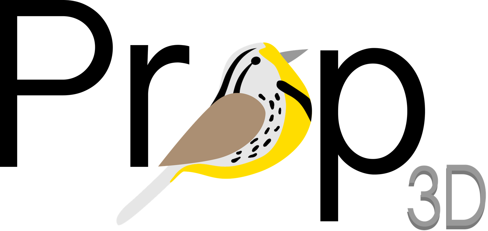
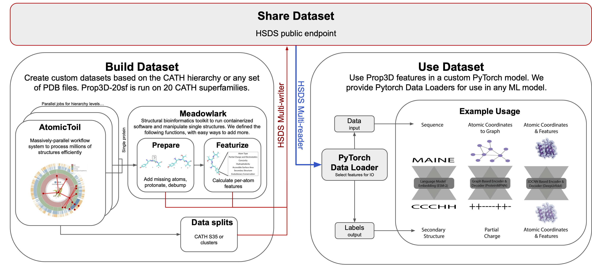

.. Prop3D documentation master file, created by
   sphinx-quickstart on Fri Jun 30 21:20:09 2023.
   You can adapt this file completely to your liking, but it should at least
   contain the root `toctree` directive.

Home
====
Prop3D is a protein structure toolkit designed for machine learning, enabling the generation and utilization of datasets that integrate 3D atomic coordinates with biophysical and evolutionary properties. Due to the massive increase in the number of available protein structures, massively-parallel reproducible workflows to create datasets that run in the cloud are needed. Prop3D is not just a dataset or workflow, it is both; it's a way to reproduce our datatsets or build your own with your own custom proteins.

To use Prop3D, you can:

#. Use our precomputed datasets to train an ML model; 
#. Build your own datasets; and 
#. Use your new datasets to train an ML model.

We provide two precalculated datasets: 

#. Prop3D-20 (20 highly populated superfamilies) and 
#. The entire PDB. In the future.

We will provide the entire CATH database and AlphaFold-CATH -- CATH mappings for all domains in AlphaFold2.

If you want to generate your own datasets, please follow the installation steps for using the :doc:`./install/hsds.rst`

Building Prop3D Datasets
------------------------

First, we created AtomicToil [based on `Toil <https://github.com/DataBiosphere/toil>`_] to create a massively-parallel workflow following the CATH hierarchy or any sets of proteins to clean () each protein and calcuate its biophyscal propteris.  We also create reproducible training set splits using either the CATH S35 clusters, PDB clusters based on mmseqs, or a calculate new clusters using foldseek.

Next, we built Meadowlark to process individual protein structures for use ML. Specifically, we "clean" each structure by adding missing atoms or residues (SCWRL, MODELLER) and add hydrogens and perform a simple energy-minimization, or 'debump' (Pdb2Pqr). We then calculate biophysical properties for the cleaned structures. All of the cleaned structures and biophysical properties are added into HDF file on an HSDS endpoint create and share the dataset.

HSDS was chosen due to its ability to share an extremely large dataset without making the user download the entire file at once and due to it's speed while training ML models.

Using Prop3D Datasets to train ML models
----------------------------------------
Finally, once you have a dataset (or just want to use our precomputed datatsets), we provide PyTorch DataLoaders to read in the specified HSDS HDF datasets from a specified 'training', 'validation', or 'test' split. The DataLoaders returns each protein with specified features used for training, such as:

#. A sequence (input) and biophysical properties (output) for use in a language model (See ESM example)
#. 3D coordinates and biophysical properties for use in custom tools that require just atomic coordinates, e.g. many graph-based models (see MPNN example) 
#. A sparse voxelized input with biophysical properties for use in 3D applications, such as 3DCNNS (see MinkowskiEngine examples)

To learn how the CATH dataset is organized, please see the `CATH Dataset Organization <dataset_org>`_

Prop3D is not meant replace (better) tools such as `Biotite <https://github.com/biotite-dev/biotite>`_ or `BioPython <https://github.com/biopython/biopython>`_, but used in combination to create ML-ready, shareable datasets.

.. toctree::
   :maxdepth: 1
   :hidden:
   :caption: Getting Started

   self
   data_processing.rst
   features.rst
   organization.rst
   precomputed_datasets.rst

.. toctree::
   :maxdepth: 1
   :hidden:
   :caption: Installation

   install/basic.rst
   install/hsds.rst
   install/precomputed_dataset.rst

.. toctree::
   :maxdepth: 1
   :hidden:
   :caption: Build Dataset

   create_dataset/cli.rst  
   create_dataset/custom_featurizers.rst

.. toctree::
   :maxdepth: 1
   :hidden:
   :caption: Use Dataset

   use_dataset/simple.rst
   use_dataset/sequence_classification.ipynb
   use_dataset/protein_mpnn.ipynb
   use_dataset/voxelized_structure.ipynb

.. toctree::
   :maxdepth: 4
   :caption: API Reference

   Prop3D.common
   Prop3D.generate_data
   Prop3D.parsers
   Prop3D.util
