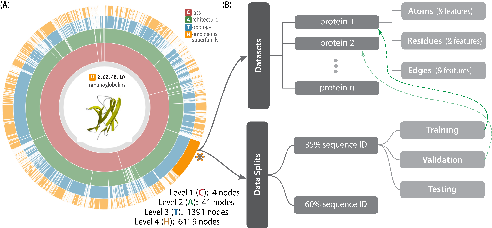

Dataset Organization
====================

CATH-based Dataset
------------------

The inherently hierarchical structure of CATH (A) is echoed in the design schema underlying the Prop3D dataset (B), as illustrated above. Prop3D can be accessed through a cloud-based HDF file (HSDS) seeded with the CATH hierarchy for all available superfamilies. For clarity, an example of one such superfamily is the individual H-group `2.60.40.10` (Immunoglobulins) shown here as the orange sector (denoted by an asterisk near 4 o'clock). Each such superfamily is further split into:

#. The ``domain`` groups, with datasets provided for each domain (atomic features, residue features, and edge features), as delineated in the upper-half of (B)
#. Pre-calculated data splits (``data_splits``), shown in the lower-half of (B), which exist as hard-links (denoted as dashed green lines) to domain groups.
#. Pre-calculated ``representatives`` for each superfamily, provided by the CATH, and are hard-linked to domain groups.

Each domains is further separated into:

#. ``atoms``, a dataset for atom-based coordinates and features
#. ``residues``, a dataset for residue-based coordinates and features (useful for coarse-gaining or graph based applications)
#. ``edges``, a dataset for residue-residue interaction graphs with edge features

The 'sunburst' style CATH diagram, from `<http://cathdb.info>`_, is under the Creative Commons Attribution 4.0 International License.

Prop3D-20 Dataset
+++++++++++++++++

For the initial release of Prop3D, we include `Prop3D-20`, a condensed dataset of just 20 superfamilies with high-population density or of interest to our `DeepUrfold <https://bournelab.org/research/DeepUrfold/>`_ project. The HSDS H5 is organized as follow:

We organize each superfamily by their CATH hierarchy within the HDF file:

.. code-block::

    /1
        /10
            /10
                /10
                    /domains
                    /data_splits
                    /representatives
            /238
                /10
                    /domains
                    /data_splits
                    /representatives
            /490
                /10
                    /domains
                    /data_splits
                    /representatives
            /510
                /10
                    /domains
                    /data_splits
                    /representatives
        /20
            /1260
                /10
                    /domains
                    /data_splits
                    /representatives
    /2
        /30
            /30
                /100
                    /domains
                    /data_splits
                    /representatives
        /40
            /50
                /140
                    /domains
                    /data_splits
                    /representatives
        /60
            /40
                /10
                    /domains
                    /data_splits
                    /representatives
    /3
        /10
            /20
                /30
                    /domains
                    /data_splits
                    /representatives
        /30
            /230
                /10
                    /domains
                    /data_splits
                    /representatives
            /300
                /20
                    /domains
                    /data_splits
                    /representatives
            /310
                /60
                    /domains
                    /data_splits
                    /representatives
            /1360
                /40
                    /domains
                    /data_splits
                    /representatives
            /1370
                /10
                    /domains
                    /data_splits
                    /representatives
            /1380
                /10
                    /domains
                    /data_splits
                    /representatives
        /40
            /50
                /300
                    /domains
                    /data_splits
                    /representatives
                /720
                    /domains
                    /data_splits
                    /representatives
        /80
            /10
                /10
                    /domains
                    /data_splits
                    /representatives
        /90
            /79
                /10
                    /domains
                    /data_splits
                    /representatives
            /420
                /10
                    /domains
                    /data_splits
                    /representatives

PDB-based Dataset
-----------------

The PDB-based datasets is organized like a single superfamily just ``domains``, ``data_splits`` and ``representatives`` at the root level. Representatives are taken from the first entry of each mmseqs 30% clusters provided by the PDB.